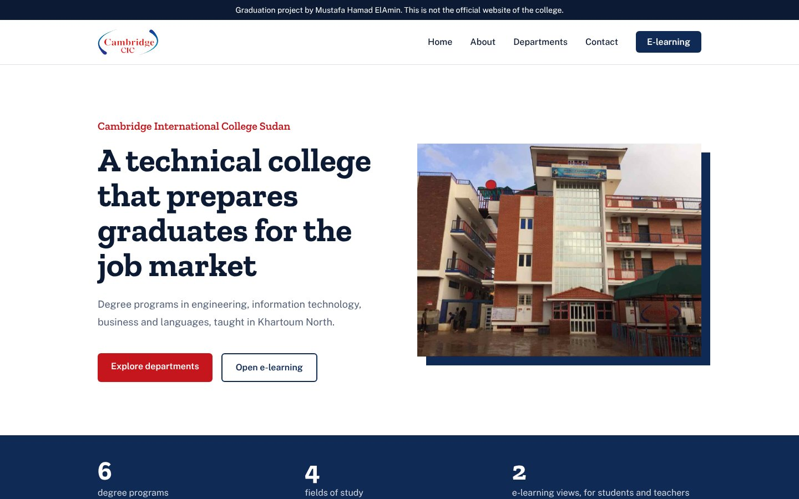

# Cambridge International College Sudan — graduation project

A website and e-learning concept for Cambridge International College Sudan, built as my graduation project and rebuilt here with Next.js and Tailwind CSS.

This is a student project. It is not the official website of the college.



## Pages

| Route | Page |
| :-- | :-- |
| `/` | Home: introduction, quick facts, vision, programs by field, e-learning, accreditation and contact |
| `/about` | About the college |
| `/departments` | All six degree programs, with a filter by field |
| `/departments/<program>` | One page for each of the six programs |
| `/e-learning` | Sign-in screen with a student / teacher switch |
| `/e-learning/student` | Student screen: overview, lectures, classes, attendance, assignments, calendar, notes |
| `/e-learning/teacher` | Teacher screen: overview, lectures, classes, attendance, assignments, reports, notes |

The e-learning part is a working demo. A student can join a class, move an assignment from started to submitted, and write notes. A teacher can start a class, take attendance and post notes to a class. It all runs in the browser with sample data: the sign-in fields are read-only, and nothing is sent or saved.

## Built with

- [Next.js 16](https://nextjs.org) (App Router)
- [React 19](https://react.dev)
- [TypeScript](https://www.typescriptlang.org)
- [Tailwind CSS 4](https://tailwindcss.com)

## Run it locally

```bash
npm install
npm run dev
```

Then open [http://localhost:3000](http://localhost:3000).

## Where things are

```
app/
├── data/college.ts        # Address, contacts, programs and accreditation
├── components/
│   ├── ProjectNotice.tsx   # "Graduation project" bar on every page
│   ├── SiteHeader.tsx      # Logo, navigation and mobile menu
│   ├── SiteFooter.tsx      # Location, contact and links
│   ├── PageHeader.tsx      # Navy title band on inner pages
│   ├── FieldCards.tsx      # Programs grouped by field, on the home page
│   ├── ProgramList.tsx     # The list of degree programs
│   ├── ProgramExplorer.tsx # The list plus the filter by field
│   ├── DepartmentPage.tsx  # Layout shared by the program pages
│   ├── SignInForm.tsx      # Demo sign-in
│   └── elearning/
│       ├── StudentDashboard.tsx
│       ├── TeacherDashboard.tsx
│       └── ui.tsx          # Tabs, cards, badges and bars both screens share
├── about/                  # /about
├── departments/            # /departments and one folder per program
├── e-learning/             # Sign-in, student and teacher screens
├── layout.tsx              # Fonts, header and footer around every page
├── not-found.tsx           # Shown for addresses that do not exist
├── page.tsx                # Home
└── globals.css             # Colors and fonts
public/                     # Logo, campus photo, accreditation logos, og.jpg
```

To add a program, add an entry to `programs` in `app/data/college.ts`, then create a folder with the same name as its `slug` under `app/departments/`, copying the `page.tsx` of an existing program.

## The original version

The first version of this project was plain HTML with Bootstrap. It is still in this repository's history, before the rebuild.
